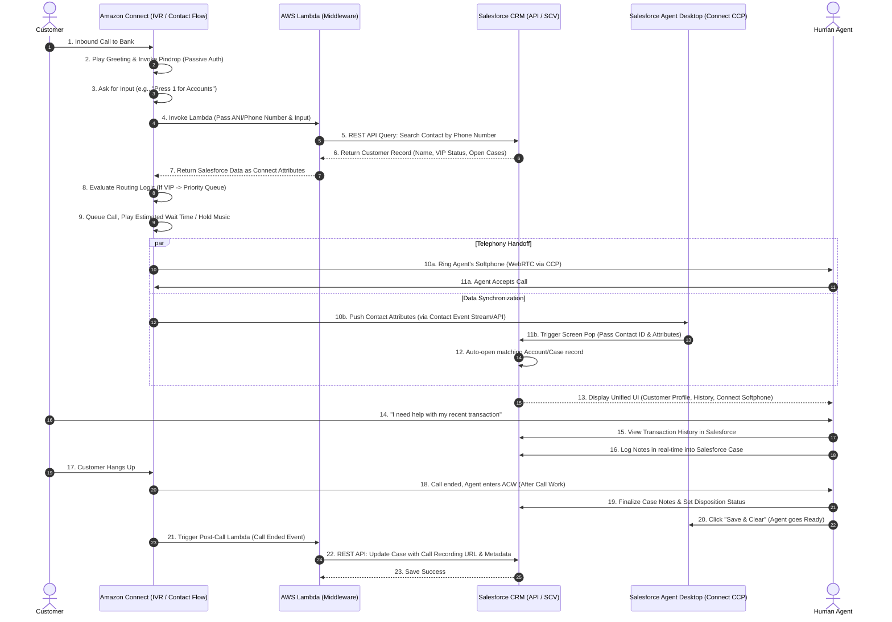

# Basic of Amazon Connect Customer

Here is an elaborate breakdown of how an Amazon Connect Custom IVR and Agent flow operates, how it integrates deeply with Salesforce CRM, and what the resulting Agent Experience looks like.

### High-Level Architecture
In an enterprise environment, Amazon Connect acts as the **Telephony and Routing engine**, while Salesforce acts as the **System of Record and Agent Desktop**. They are bridged using **AWS Lambda** (for IVR data lookups) and the **Salesforce Service Cloud Voice (SCV)** or **Amazon Connect Salesforce SDK** (for real-time agent screen-pops and state synchronization).

---

### Elaborate Sequence Diagram

---

### Phase-by-Phase Breakdown

#### Phase 1: The IVR Experience & CRM Pre-Lookup
When the customer calls, Amazon Connect answers via the Contact Flow. Instead of just playing generic hold music, Connect uses AWS Lambda to query Salesforce *before* the caller even speaks to an agent.
1. **Authentication & Context:** Connect captures the caller's ANI (Phone Number). A Lambda function queries Salesforce's REST API to find the matching Contact/Account.
2. **Personalization:** If Salesforce identifies the caller, Connect uses Text-to-Speech to say, *"Welcome back, Mr. Smith."*
3. **Intelligent Routing:** Connect reads Salesforce attributes (e.g., `Customer_Tier = VIP` or `Open_Dispute = True`). Instead of sending the caller to a generic queue, Connect routes them directly to a specialized "Tier 2 Disputes" queue or a VIP agent.

#### Phase 2: The Handoff & Screen Pop
This is where telephony meets the UI. The goal is "Zero-Click" screen pops—the agent shouldn't have to search for the customer.
1. **Simultaneous Events:** When the call is routed to an agent, two things happen in parallel. The WebRTC audio stream rings the agent's headset through the Amazon Connect CCP (Communication Control Panel), and Amazon Connect sends a payload of metadata (Contact Attributes) to Salesforce.
2. **Screen Pop:** Salesforce Service Cloud Voice receives this payload. It uses the Contact ID to automatically open the exact Salesforce Account, Contact, and potentially a new Case record on the agent's screen exactly as the agent answers the phone.

#### Phase 3: The In-Call Agent Experience
The agent is now talking to the customer while looking at a unified Salesforce interface.
1. **Unified UI:** The agent does not toggle between a telephony app and a CRM app. The Amazon Connect softphone (accept, hold, transfer, mute) is embedded directly as a floating widget inside the Salesforce Service Console.
2. **Context at Fingertips:** Because the agent already has the customer's Salesforce record open, they can see recent transactions, previous support cases, and marketing data. 
3. **Real-Time Logging:** The agent can type notes directly into a Salesforce Case record while the call is active.
4. **Omni-Channel Transfer:** If the agent needs to transfer the call, they use the Salesforce transfer UI, which translates into a Connect cold/warm transfer. The agent can select a specific queue or another agent, and the Salesforce Case context follows the call to the next agent.

#### Phase 4: Post-Call Wrap-Up (ACW) & Data Sync
1. **After Call Work (ACW):** When the customer hangs up, the Connect CCP automatically changes the agent's status to "ACW" (After Call Work). This pauses the routing of new calls to them, giving them time to finish notes.
2. **Dispositioning:** The agent selects a wrap-up code (e.g., "Resolved", "Escalated") which is mapped to a Salesforce Picklist.
3. **Data Sync:** 
   * The agent clicks "Save" in Salesforce, which completes the Case record and sets the agent back to "Available" in Connect.
   * Simultaneously, Amazon Connect drops a Post-Call Lambda event. This Lambda takes the Amazon Connect Call Recording URL (stored in Amazon S3) and attaches it as a hyperlink directly to the Salesforce Case object. This allows bank managers or compliance officers to listen to the recording directly from Salesforce without needing AWS Console access.

### Summary of the Agent Experience
For the human agent, this integration feels seamless. 
* **They log into Salesforce**, which automatically logs them into the Amazon Connect telephony system in the background.
* **They see one screen.** Telephony controls and Customer Data are unified.
* **They never search for a customer.** The system pushes the customer's record to their screen the second the phone rings.
* **They have full context.** They can verify the Pindrop authentication status and OAuth2 authorization scopes (from your previous architecture) right on the Salesforce screen.
* **Their wrap-up is streamlined.** Notes and call recordings are automatically linked to the customer's master record.