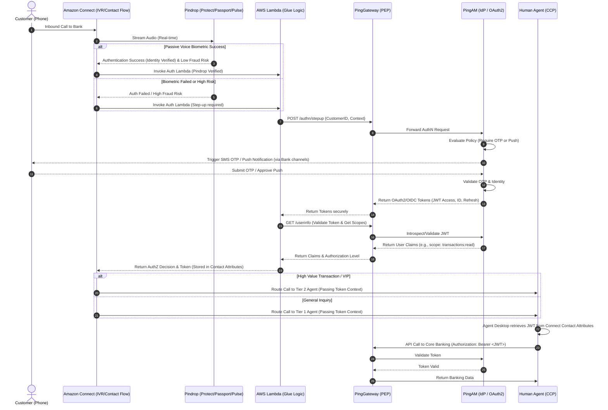
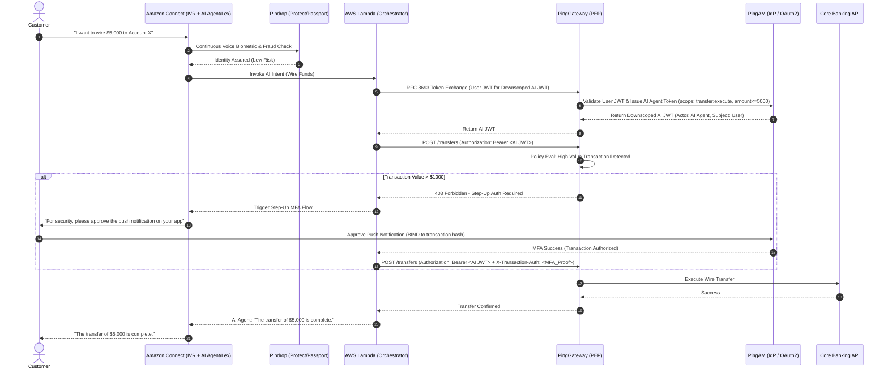

## Telephony AuthN & AuthZ Integration - Mix up of PingAM, Pindrop and Amazon Connect

### Human Agent Desktop Integration

Yes, **this is absolutely possible and represents a highly secure, modern architecture for enterprise banking.** 

By integrating Amazon Connect with PingAM and PingGateway, you transition from a basic voice-biometric/fraud-detection model (Pindrop) to a **full Identity and Access Management (IAM) governed telephony platform**. 

Here is how the components interact:
1. **Amazon Connect (Orchestrator):** Uses AWS Lambda functions within Contact Flows to make real-time API calls.
2. **Pindrop (Passive AuthN/Fraud):** Provides the first layer of verification (voice biometrics via Passport/Pulse and fraud detection via Protect).
3. **PingGateway (Policy Enforcement Point - PEP):** Acts as the secure API gateway. It intercepts requests from Connect, validates any existing tokens, and proxies requests to PingAM.
4. **PingAM (Identity Provider - IdP):** Handles active authentication (e.g., OTP, push notifications), issues OAuth2/OIDC JWT tokens, and manages user consent and scopes.
5. **Agent Desktop / CCP:** Receives the OIDC token via Amazon Connect contact attributes, allowing the human agent to use that token for SSO into backend banking systems without asking the customer for passwords.

---

### Sequence Diagram: Telephony AuthN & AuthZ Integration

Below is the Mermaid sequence diagram illustrating a customer calling in, being passively verified by Pindrop, step-up authenticated via PingAM, and issued an OAuth2/OIDC token for the agent.

### Step-by-Step Explanation of the Flow:

1. **Call Inception & Pindrop Passive Auth:** The customer calls the bank. Amazon Connect answers and streams the audio to Pindrop. Pindrop Passport/Pulse attempts to passively authenticate the caller via voice biometrics, while Protect assesses fraud risk.
2. **Lambda Evaluation:** Amazon Connect invokes an AWS Lambda function. If Pindrop verifies the user with high confidence, the Lambda might still request a token from PingAM. If Pindrop fails or flags high risk, Lambda forces a step-up authentication.
3. **PingGateway Request:** Lambda sends a secure API request to PingGateway containing the customer's identifier (e.g., ANI/Phone Number or Account ID). PingGateway acts as the reverse proxy protecting PingAM.
4. **Step-Up MFA (PingAM):** PingAM evaluates the authentication requirements. Since this is a bank, it requires a second factor. PingAM triggers an OTP via SMS or a Push Notification to the customer's banking app.
5. **Customer MFA Response:** The customer provides the OTP via IVR keypad (Connect sends this to Lambda, which forwards it to Gateway) or approves the push on their mobile device.
6. **Token Issuance:** PingAM validates the MFA, generates an OAuth2/OIDC JWT (JSON Web Token) containing scopes (e.g., `account:read`, `transfer:execute`), and returns it to Lambda via PingGateway.
7. **Token Validation & Claims:** Lambda calls the `/userinfo` or introspection endpoint via PingGateway to ensure the token is valid and retrieves the authorization claims.
8. **Contact Attributes:** Lambda passes the token and claims back to Amazon Connect, storing them as Contact Attributes.
9. **Routing:** Amazon Connect routes the call to the appropriate agent queue based on the claims (e.g., routing to a wealth management queue if the token scope indicates a high-net-worth individual).
10. **Agent SSO & API Authorization:** The human agent's desktop (CCP) pulls the JWT from the Amazon Connect contact attributes. When the agent needs to pull up the customer's account on their screen, the agent desktop uses that JWT in the `Authorization: Bearer` header to call backend banking APIs via PingGateway. 

### Architectural Best Practices for this Integration:

*   **Latency Management:** Voice calls are real-time. Ensure PingAM, PingGateway, and the Amazon Connect Lambda functions are all hosted in the same AWS Region (e.g., `us-east-1`) to keep API latency under 200ms.
*   **Token Transmission:** Do not pass the raw JWT over unencrypted telephony lines. Keep the token between Connect, Lambda, and the Agent Desktop via secure Contact Attributes.
*   **Token Lifespan:** Since telephony interactions can be long, use short-lived Access Tokens (e.g., 15 mins) and leverage PingAM Refresh Tokens to silently renew the agent's session if the call lasts longer than the token's lifespan.
*   **JWKS Caching:** Configure PingGateway to cache PingAM's JWKS (JSON Web Key Set) public keys so it doesn't have to query PingAM for every single token validation, drastically reducing latency.

### AI Agent Desktop Integration

Introducing AI Agents (e.g., conversational IVR bots, LLM-based autonomous assistants in Amazon Connect) that can execute actions on behalf of a user takes the architecture from basic authentication to **Agentic CIAM (Customer Identity and Access Management)**. 

In an enterprise bank, an AI Agent cannot simply use the customer's broad access token to move money or change profiles. It requires **Delegated Authorization**, strict **Scope Limitation**, and **Transaction-Level Step-Up**.

Here is how you integrate AI Agents into the Pindrop + PingAM + Connect architecture, followed by the mandatory enterprise controls.

---

### Sequence Diagram: Agentic CIAM Flow

This diagram illustrates a customer asking the AI Agent to perform a high-value action (e.g., "Wire $5,000 to Account X").

---

### How It Works: The Architecture

1. **The AI Agent (Amazon Lex/Q in Connect):** The AI parses the user's intent. Instead of executing the transaction directly, it triggers a Lambda function.
2. **OAuth2 Token Exchange (RFC 8693):** The Lambda function takes the customer’s base OIDC token (obtained earlier via Pindrop/PingAM) and exchanges it at PingAM for an **AI Agent Token**. 
   * *Subject (sub)* = Customer ID
   * *Actor (act)* = AI Agent ID
   * *Scopes (scp)* = `transfer:execute` (downscoped from the customer's full privileges).
3. **PingGateway Policy Enforcement:** The AI Agent presents this token to PingGateway to call the Core Banking API. PingGateway evaluates the token, the requested action, and the transaction amount.
4. **Transaction-Level Step-Up:** If the transaction exceeds a risk threshold (e.g., >$1,000), PingGateway rejects the API call and demands transaction-specific MFA. PingAM sends a push notification to the user's phone, containing a cryptographic hash of the transaction details (Amount, Destination). The user must approve *that specific* transaction.

---

### Enterprise Bank-Level Hardening Controls

To pass a banking security audit (e.g., SOC2, FFIEC, PSD2/SCA), the following controls must be implemented:

#### 1. Non-Repudiation & Identity Binding (Pindrop + PingAM)
* **Continuous Authentication:** Pindrop cannot just authenticate at the beginning of the call. It must run continuously. If the voice changes mid-call (e.g., fraudster takes over the line), Pindrop must send an event to PingAM to instantly revoke the AI Agent's OAuth2 token.
* **Proof of Possession (PoP) Tokens:** Do not use standard Bearer tokens for AI Agents. Use DPoP (Demonstrating Proof-of-Possession) or MTLS-bound tokens. This ensures the token issued to the AI Agent cannot be stolen and replayed by another process.

#### 2. AI Guardrails & Constrained Delegation
* **Strict Scopes:** The AI Agent must never receive the user's raw access token. PingAM must issue a highly restricted token to the AI. For example, if the user asks to check a balance, the AI gets a token with `accounts:read`. It cannot use that token to initiate a transfer.
* **Intent-to-API Mapping:** The AI Agent (LLM) should not dynamically generate API payloads. The AI extracts parameters (amount, account), and Lambda maps these strictly to predefined API schemas to prevent injection attacks.
* **Human-in-the-Loop (HITL) Fallback:** If the AI's confidence score on intent extraction is below a threshold (e.g., 90%), the system must fall back to a human agent or explicitly refuse the transaction.

#### 3. Transaction Risk Authorization (PingGateway + PingAM)
* **Risk-Based Step-Up:** PingGateway must act as a dynamic Risk Engine. A $10 transfer might pass with just the AI token. A $10,000 transfer requires PingAM to trigger a biometric push notification (binding the exact transaction details so the AI cannot alter them after approval).
* **Break-Glass Procedures:** PingAM must have controls to instantly freeze AI Agent token issuance if a systemic fraud pattern (detected by Pindrop Protect) is identified.

#### 4. Immutable Audit Logging
* **Separation of Audit Trails:** Every API call made by the AI Agent must log both the `sub` (Customer) and the `act` (AI Agent). 
* **Action Ledger:** Amazon Connect/Lambda must write an immutable ledger to Amazon S3 (Object Lock) or a blockchain (e.g., Amazon QLDB) recording: "At 14:02, User X instructed AI Y to transfer $5,000. Pindrop score was 95. PingAM MFA approved at 14:03."
* **Voice Recording Retention:** The Connect call recording must be linked via metadata to the PingAM transaction ID, ensuring compliance teams can replay exactly what the customer said to authorize the AI's action.