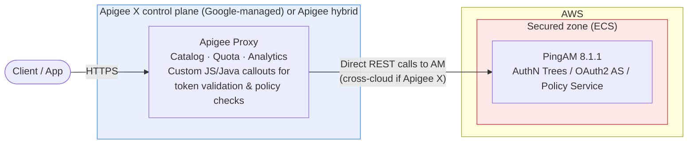
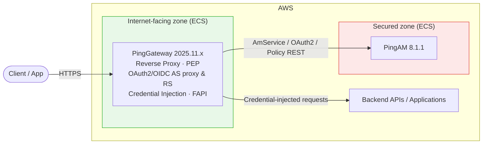
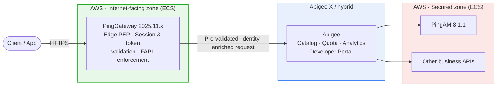
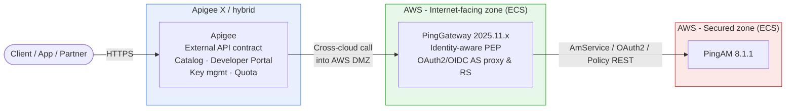

# Architecture Decision Review (ADR)

## PingGateway / Apigee Coexistence Patterns with PingAM on AWS

| Field | Value |
|---|---|
| **ADR ID** | ADR-IAM-2026-XX |
| **Status** | Draft — for review |
| **Date** | 2026-09-08 |
| **Author** | (Enterprise Architecture / IAM) |
| **Components in scope** | PingGateway **2025.11.x**, PingAM **8.1.1**, Apigee (X / hybrid), AWS (ECS) |
| **Reviewers** | Security Architecture, Network/Cloud Platform, API Platform, IAM Engineering |

---

## 1. Purpose

This ADR evaluates four coexistence patterns for introducing **Apigee** as the enterprise API management (APIM) layer into an existing identity architecture where **PingGateway** already operates as the internet-facing reverse proxy / Policy Enforcement Point (PEP) in front of **PingAM**, deployed on AWS ECS.

The intent is to determine, per pattern, whether Apigee alone, PingGateway alone, or both in combination (in either order) is the correct topology for a given class of API — and to document the trade-offs so that a routing decision can be made consistently per API/domain rather than ad hoc.

## 2. Scope note — what "PingGateway involvement" means here

This review deliberately does **not** treat PingGateway as a bare reverse-proxy hop in front of a single AM REST endpoint (e.g. a raw `/json/authenticate` call). That framing understates what PingGateway is for and produces a misleading "extra hop with no value" conclusion.

Wherever PingGateway appears in the patterns below, it is performing one or more of its **documented capabilities** as an identity-aware reverse proxy / PEP, specifically:

- **Policy Enforcement Point (PEP)** — evaluating PingAM policy decisions (via the Policy Enforcement filter) before allowing a request to reach a protected resource, rather than passing the resource straight through.
- **OAuth2 / OIDC Authorization Server (AS) proxying** — mediating authorization code, CIBA/backchannel, and token endpoints, including PAR/JAR handling and FAPI-profile enforcement (PingGateway 2025.9+ ships full FAPI support; 2025.11 adds further FAPI hardening).
- **OAuth2 / OIDC Resource Server (RS) function** — validating bearer/DPoP tokens at the edge via `OAuth2ResourceServerFilter` before a request is dispatched to a backend, so backends never see unvalidated tokens.
- **Session and token exchange handling** — `AmService`/`SingleSignOnFilter` integration for CDSSO/session-cookie validation, JWT session support, and OAuth 2.0 Token Exchange for delegation/impersonation use cases.
- **Identity assertion / credential injection** — translating a validated session or token into headers, basic-auth, or other credentials a legacy backend expects (`IdentityAssertionHandler`), so backend systems remain unaware of the AM protocol.
- **Reverse-proxy routing and resilience** — `ReverseProxyHandler`, reloadable route properties, graceful shutdown, and (as of 2025.11) evolving support for protecting MCP (Model Context Protocol) services, relevant if agentic/AI workloads are on the roadmap.

In short: everywhere PingGateway sits in this document, assume it is doing **PEP + token/session mediation + credential translation**, not simply forwarding a login POST.

## 3. Context

- **PingAM 8.1.1** is deployed in a **secured network zone** in AWS, hosting authentication trees, the OAuth2/OIDC provider, and policy sets. AM 8.1.x introduces node versioning, an enhanced tree/nodes REST API (`resource=3.0`), transactional authentication trees, backchannel authentication nodes, and FIPS-compliant configurations — all of which are more fully exploited when a capable PEP (PingGateway) mediates access rather than a generic API gateway.
- **PingGateway 2025.11.x** is deployed in the **internet-facing zone** on ECS, acting as the current edge PEP for AM-protected and AM-integrated resources.
- **AWS ECS** hosts both components. Apigee is being introduced for API lifecycle management: developer portal, catalog, quota/rate plans, analytics, monetization, and consistent external API contracts.
- **Apigee deployment model is a first-order variable.** Apigee X (SaaS control plane, Google-managed) implies the Apigee runtime lives outside the AWS account — any hop into/out of Apigee is a **cross-cloud** hop requiring VPC peering, Private Service Connect, Interconnect/Direct Connect, or a VPN, with associated latency and egress cost. Apigee hybrid, self-managed on a Kubernetes runtime (including EKS in the same AWS region/VPC), removes the cross-cloud hop and changes the cost/latency profile materially. **This ADR assumes Apigee X (SaaS) as the base case** and calls out where hybrid-in-AWS changes the conclusion.

## 4. Decision Drivers

| # | Driver |
|---|---|
| D1 | Preserve PingAM-specific PEP capabilities (policy evaluation, session/token handling, FAPI, transactional auth, credential injection) without re-implementation |
| D2 | Minimize added latency and network hops for high-volume, latency-sensitive identity traffic |
| D3 | Minimize cross-cloud dependency and associated egress cost / failure domain |
| D4 | Provide API governance (catalog, developer portal, quota, monetization, analytics) where APIs are externally or partner-consumed |
| D5 | Maintain a clear, auditable security boundary at the true internet edge |
| D6 | Avoid duplicated/conflicting policy enforcement (rate limiting, TLS, auth) across two control planes |
| D7 | Keep operational ownership boundaries clear (who owns which layer, who's on call) |

## 5. Options Considered

### Option 1 — Apigee only (no PingGateway)

Apigee is the sole edge component. It terminates client traffic and calls PingAM directly (trees REST API, OAuth2/OIDC endpoints, policy REST API) as a backend target, implementing any PEP-like behavior itself via JavaScript/Java policy callouts.

**Pros**
- Single control plane and policy language for all API traffic, including identity APIs — one place for catalog, quota, analytics.
- No PingGateway compute/licensing footprint to run, patch, and staff.
- Single hop from edge to AM (no double proxy).

**Cons**
- All PingGateway PEP capabilities (§2) — policy enforcement, FAPI-compliant AS/RS behavior, transactional-auth support, session/JWT handling, credential injection for legacy backends, MCP protection — must be **re-implemented as custom Apigee callouts**. This is real, ongoing engineering effort that drifts out of sync with each AM/PingGateway release.
- Apigee (a SaaS/third-party-managed control plane, if Apigee X) now requires network reachability into the **secured zone** to reach AM directly — a materially larger security exception than "IG talks to AM," and one that security teams frequently reject outright.
- Generic API gateway rate-limiting/spike-arrest is not equivalent to AM/IG's purpose-built protections against credential stuffing and malformed authentication requests tuned to tree semantics.
- No FAPI-certified AS/RS behavior out of the box — FAPI conformance would need to be built and maintained in Apigee rather than consumed from PingGateway 2025.9+/2025.11.

**Suitability**
- Viable **only** where AM is used narrowly as a plain OAuth2/OIDC token issuer (no complex Intelligent Access journeys, no FAPI requirement, no transactional auth) **and** Apigee hybrid is self-managed inside the AWS account (removing the cross-cloud/secured-zone objection). Not recommended as a general pattern given D1 and D3.

---

### Option 2 — PingGateway only (no Apigee)

Current-style architecture extended to any new API, without introducing Apigee at all.

**Pros**
- Purpose-built integration with AM: session/journey-aware, FAPI-capable AS/RS, transactional-auth support, credential injection — no re-implementation.
- Lowest latency: single hop, single cloud, no cross-cloud round trip.
- Smallest attack surface and simplest network topology; no external control-plane dependency for identity traffic.

**Cons**
- No developer portal, API catalog, monetization, or business-level analytics.
- Weaker multi-backend mediation, versioning, and self-service consumer onboarding than a dedicated APIM product.
- Doesn't scale well as an enterprise-wide API strategy if the ambition extends beyond identity/auth into a broad partner/public API catalog.

**Suitability**
- Appropriate where Apigee's scope is genuinely out of the picture for this class of API — identity/access is the only concern for the API surface in question, or a separate gateway/APIM already handles non-identity business APIs elsewhere. Strong fit for D1, D2, D3, D5; weak on D4.

---

### Option 3a — PingGateway in front of Apigee

`Internet → PingGateway (edge PEP) → Apigee (catalog/governance) → PingAM + other backends`

PingGateway is the literal internet edge and performs PEP duties (policy check, token/session validation, FAPI enforcement, credential shaping) before the request is handed to Apigee for catalog/quota/analytics/routing across the broader API estate, of which AM is one backend among many.

**Pros**
- Identity-sensitive traffic is authenticated, policy-checked, and enriched by the purpose-built PEP **before** it ever reaches a third-party/SaaS-managed control plane — satisfies security postures that mandate a self-controlled, hardened component as the literal internet-facing layer.
- Apigee receives a uniform, already-authenticated/enriched request stream and needs no AM-specific custom logic — it can focus purely on catalog/quota/analytics.
- Keeps the SaaS/external control plane one layer back from the internet, reducing its exposure and blast radius.

**Cons**
- Two proxy hops for every request, including simple ones — added latency with no functional benefit unless the downstream API genuinely needs Apigee's catalog/quota/monetization treatment.
- Cross-cloud round trip if Apigee X (AWS → GCP → AWS secured zone), with associated latency and data-egress cost.
- Two policy layers (IG and Apigee) must be kept from conflicting — e.g. duplicate rate limiting, duplicate TLS termination decisions — requiring clear ownership rules (D6).

**Suitability**
- Best where regulatory or security policy mandates a self-managed reverse proxy as the literal edge, and the same front door also serves a broad catalog of business APIs that genuinely benefit from Apigee governance. Strongest fit for D1 and D5; weakest on D2/D3 unless paired with Apigee hybrid in-VPC.

---

### Option 3b — Apigee in front of PingGateway

`Internet → Apigee (external front door/catalog) → PingGateway (identity PEP) → PingAM`

Apigee is the single external contract and developer-facing catalog for all APIs, including identity/auth endpoints; it forwards identity traffic to PingGateway, which retains full PEP responsibility immediately in front of the secured zone.

**Pros**
- One consistent external contract/catalog for all API consumers, including auth endpoints — valuable if partners/third parties consume OAuth2/OIDC endpoints and you want them cataloged, key-managed, and rate-limited like any other product (D4).
- PingGateway still performs full PEP duty immediately in front of AM, so no loss of session/journey/FAPI sophistication (D1).
- Clean separation of concerns: Apigee = external productization, PingGateway = identity-aware moat around the secured zone.

**Cons**
- Same double-hop latency as 3a, plus the cross-cloud leg now sits **first**, on the public-facing side, rather than internally.
- The literal internet-facing edge is now a third-party/SaaS-hosted control plane rather than infrastructure fully owned by the organization — a materially different risk posture than 3a; some security teams will not accept this for authentication traffic (D5).
- Duplicate enforcement risk (TLS, rate limiting, auth) needs explicit ownership rules, same as 3a (D6).

**Suitability**
- Best where Apigee is mandated as the enterprise-wide API front door for consistency/governance reasons, and identity APIs are meant to be discoverable/consumable through the same channel as any other API product, while PingGateway is retained as the last line of defense directly in front of AM. Weaker fit than 3a on D5 (edge ownership).

## 6. Comparative Decision Matrix

| Driver | Opt 1: Apigee only | Opt 2: IG only | Opt 3a: IG → Apigee | Opt 3b: Apigee → IG |
|---|---|---|---|---|
| D1 — PEP capability preserved | ✗ (rebuilt in Apigee) | ✓ native | ✓ native | ✓ native |
| D2 — Latency / hops | ✓ single hop | ✓ single hop | ✗ double hop | ✗ double hop |
| D3 — No cross-cloud dependency | ✗ (unless Apigee hybrid in-VPC) | ✓ | ✗ (unless Apigee hybrid in-VPC) | ✗ (unless Apigee hybrid in-VPC) |
| D4 — API governance (catalog/portal/monetization) | ✓ | ✗ | ✓ | ✓ |
| D5 — Self-controlled internet edge | ✗ | ✓ | ✓ | ✗ |
| D6 — Single, unambiguous enforcement point | ✓ | ✓ | ✗ (needs governance) | ✗ (needs governance) |

*(✓ = favorable; ✗ = unfavorable / needs mitigation)*

## 7. Recommendation

No single pattern is universally correct; the routing decision should be made **per API/domain**, not once for the whole estate:

1. **Pure identity/session traffic consumed only by internal or first-party apps** (login, session refresh, step-up, policy checks against internal resources) → **Option 2**. No governance benefit from Apigee outweighs the added hop and cross-cloud exposure.
2. **Identity/OAuth2 endpoints that are also externally/partner-productized** (e.g. an OIDC provider offered to third-party consumers who need a developer portal, API keys, quota tiers) → **Option 3b** if Apigee must be the single enterprise front door, or **Option 3a** if security policy requires a self-owned component at the literal internet edge and Apigee's role is governance-of-record rather than edge trust anchor.
3. **General business/domain APIs with no PingAM/PEP involvement** → **Option 1**, using Apigee alone; PingGateway is not a relevant participant for these paths.
4. **Do not adopt Option 1 for any API path that depends on AM PEP features** (policy decisions, FAPI, transactional auth, credential injection, MCP protection) unless that logic is deliberately and fully rebuilt in Apigee — this is a significant, ongoing engineering commitment, not a one-time migration cost.

Regardless of pattern chosen for governed/external paths, strongly evaluate **Apigee hybrid self-managed on EKS in the same AWS region/VPC** as PingGateway/PingAM. This removes the cross-cloud leg from Options 1, 3a, and 3b, shrinking the double-hop cost from a cross-cloud round trip to intra-VPC network time (typically low single-digit milliseconds), and removes the cross-cloud data-egress cost line entirely.

## 8. Consequences & Follow-on Decisions

- **Network design**: for any option involving Apigee X (SaaS), a formal connectivity decision (VPC peering / PSC / Interconnect / VPN) is required and should be tracked as a separate ADR, including a threat model for the secured-zone exposure in Option 1.
- **Policy ownership**: for Options 3a/3b, define explicitly which layer owns rate limiting, TLS termination, and authentication enforcement to avoid conflicting configuration (D6). Recommend: PingGateway owns identity/session/token enforcement; Apigee owns quota, spike arrest for non-identity traffic, and catalog-level policy.
- **Observability**: two control planes in 3a/3b means correlation IDs must be propagated end-to-end (client → Apigee → IG → AM) for traceability; confirm this before go-live.
- **FAPI/regulated flows**: if any consumer requires FAPI-certified behavior, this drives strongly toward keeping PingGateway as the AS/RS proxy immediately in front of AM (all options except Option 1) rather than reimplementing FAPI logic in Apigee.
- **Roadmap flag**: PingGateway 2025.11.x's evolving MCP protection support is relevant if agentic/AI-agent traffic patterns (consistent with AM 8.1.1's AI-agent identity attribute support) are anticipated; factor this into the Option 2 vs 3a/3b decision for those specific paths.

## 9. References

- PingGateway release notes — What's new (2025.11.x, 2025.9): docs.pingidentity.com/pinggateway/release-notes/whats-new.html
- PingGateway release notes — Removed/Deprecated: docs.pingidentity.com/pinggateway/release-notes
- PingAM release notes — New in AM 8.1.x: docs.pingidentity.com/pingam/release-notes/whats-new-8.1.html
- Apigee X vs. Apigee hybrid deployment models: cloud.google.com/apigee/docs

---
*This document is a draft for architecture review board discussion. Diagrams are logical/conceptual and do not represent final network CIDR or security-group design.*
