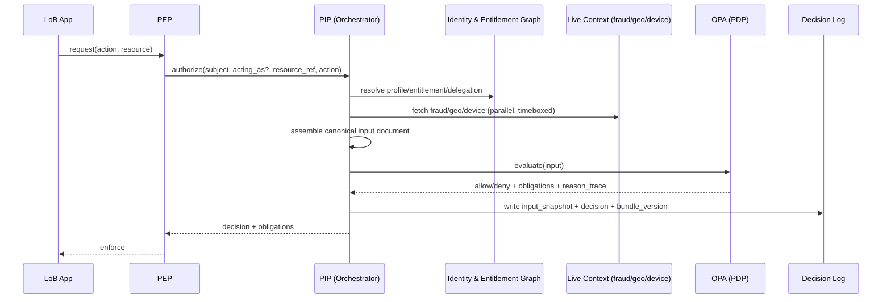

# Architecture Decision Records — Central Authorization Engine (OPA-based)

**Program:** Enterprise Permissions / Central Authorization Service
**Scope:** Cross-LoB authorization for customer-facing and internal applications
**Status:** Proposed for review
**Date:** 2026-09-10

---

## ADR-000: Context and Index

### Context

The bank is building a central authorization system used by multiple lines of business. A customer may hold multiple profiles across multiple products; each product exposes different access granularities; access can be further modified by delegation (POA, joint holders, corporate mandates) and by contextual constraints (geography, channel, fraud risk band). The engineering team has proposed:

- OPA as the policy evaluation engine
- A relational table encoding `role × constraint × persona × action` combinations
- That table populated as a **sink** fed by events/webhooks/APIs from systems of record (SORs) across the bank

The concern raised is **role explosion** and whether OPA is being used as intended. This ADR set replaces the table-as-decision-source design with a **Policy Decision Point / Policy Enforcement Point / Policy Information Point (PDP/PEP/PIP)** architecture, adds a formal **Policy Retrieval Point (PRP)**, and treats the relational store as a **derived, non-authoritative read model**, not a sink of decisions.

### Index of Decisions

| ADR | Decision |
|---|---|
| 001 | Adopt PDP/PEP/PIP/PRP pattern; reject the enumerated role-matrix table as the authorization source |
| 002 | Identity & Entitlement Attribute Graph as a CQRS read model, not a decision store |
| 003 | Canonical OPA input contract and runtime assembly pipeline |
| 004 | Policy modeling standard — ABAC/ReBAC Rego packages; "roles" become reporting views, not stored rows |
| 005 | Policy lifecycle governance and segregation of duties |
| 006 | Decision auditability, explainability, and point-in-time replay |
| 007 | Deployment topology and non-functional requirements |

---

## ADR-001: Adopt PDP/PEP/PIP/PRP Architecture; Reject the Enumerated Role-Matrix Table

**Status:** Accepted

### Context

The proposed table encodes every valid combination of role, constraint, persona and action as rows, with OPA doing a lookup against that table. With N products, G geographies, F fraud bands, D delegation states and A actions, the row count grows multiplicatively (`N×G×F×D×A`), and every new dimension (a product, a new fraud band, a new delegation type) multiplies the existing set rather than adding to it linearly. In banking this dimension count only grows over time (new products, new regulatory geos, new fraud models).

Beyond the combinatorics, the design collapses three things that must stay separable for audit and regulatory reasons: **who the subject is** (identity/attributes), **what is permitted** (policy), and **what happened** (decision record). If the table drifts from the Rego and from the SOR feeding it, there is no way to know which one is "correct" at 2pm on a given day.

### Decision

Adopt the standard externalized authorization pattern, with four distinct components:

- **PEP (Policy Enforcement Point):** a thin interceptor embedded in each LoB application/API gateway. It never contains logic — it calls `/authorize` and enforces the boolean/obligation result.
- **PDP (Policy Decision Point):** OPA itself. Stateless. Evaluates a supplied input document against versioned Rego policy. Returns `allow/deny` + obligations (e.g., step-up auth required, mask field X) + a reason trace.
- **PIP (Policy Information Point):** an orchestration service that, per request, assembles the OPA input document by querying the identity/attribute graph (ADR-002) and live context adapters (fraud, geo, device). This is where "resource and constraint discovery" — the capability you were trying to get from the table — actually lives.
- **PRP (Policy Retrieval Point):** the Git-backed policy repository, CI/CD pipeline, and bundle registry that builds, tests, signs and publishes Rego bundles that OPA pulls at runtime.

No application calls OPA directly, and no application queries the identity graph directly — everything goes through the PEP → PIP → PDP chain. This is what gives you a single enforcement surface and a single audit surface.

### Alternatives Considered

1. **Enumerated role-matrix table (as proposed).** Rejected: combinatorial growth, three sources of truth, poor auditability, doesn't use OPA's expressiveness.
2. **OPA with no PIP, evaluating directly against SOR APIs at request time.** Rejected: couples decision latency to N SOR calls per request, and pushes attribute-resolution logic into Rego, which becomes unreadable and untestable.
3. **Fully embedded per-app authorization logic (status quo in most banks).** Rejected: this is the problem the program exists to solve — duplicated, inconsistent, unauditable logic per LoB.

### Consequences

- **Positive:** linear growth (new product = new Rego package + graph mapping, not a new multiplicative row set); a single place to test, version and audit policy; OPA used as intended — composing attributes/relationships declaratively.
- **Negative:** more moving parts than a table lookup; requires investment in the identity graph and PIP orchestration before the first policy ships; requires policy-engineering skill (Rego) the team may not have yet — plan for training/tooling (OPA `test`, `conftest`, Rego playground) as part of rollout, not as an afterthought.
- **Neutral:** the relational database the team already proposed doesn't go away — it's repurposed as the identity/attribute graph behind the PIP (ADR-002), so existing SOR-integration work is not wasted.

---

## ADR-002: Identity & Entitlement Attribute Graph as a CQRS Read Model

**Status:** Accepted

### Context

SORs across the bank (customer master, KYC, each product's core system, delegation/mandate systems) own the authoritative data for profiles, product holdings, entitlement grants and delegation. The original proposal has this data flow into the permissions database as a "sink." That's the right integration shape, but the wrong ownership model if the sink is what OPA decides against directly — it becomes a second source of truth for entitlement facts, and a *third* source of truth for volatile signals if fraud/geo scores are also mirrored there.

### Decision

Build the relational store as a **CQRS read model** — an "Identity & Entitlement Attribute Graph" — with these rules:

1. **Relatively static facts** (customer↔profile↔product↔entitlement↔delegation relationships) are materialized here via event-driven projections from SOR events (Kafka/webhook), idempotent on `(source_system, source_event_id)`, versioned with effective-dating (`effective_from`/`effective_to`), never hard-deleted.
2. **Volatile signals** (fraud score, device trust, real-time geo/IP) are **never materialized as current-state rows** here. They are fetched live, per request, from their owning services by the PIP, with a short TTL cache (seconds, not the record's lifetime) purely for burst protection — not as a queryable fact.
3. A scheduled **reconciliation job** compares graph state against SOR snapshots (checksum or row-count diff per entity) and raises drift alerts; the graph is corrected from the SOR, never the reverse.
4. SORs remain the system of record for legal/regulatory purposes. The graph is disposable and rebuildable by replaying the event log — it holds no data that can't be reconstructed from source.

### Data Model (representative)

```
subject(subject_id, subject_type, natural_person_ref, status, created_at)
profile(profile_id, subject_id, product_line, profile_type, effective_from, effective_to)
product_entitlement(
  entitlement_id, profile_id, product_id, resource_type, granularity_level,
  effective_from, effective_to, source_system, source_event_id, ingested_at
)
relationship(
  relationship_id, subject_id, related_subject_id, relationship_type, -- e.g. delegate-of, joint-holder, POA
  scope_json, effective_from, effective_to, source_system, source_event_id
)
delegation(
  delegation_id, delegator_subject_id, delegate_subject_id, product_id,
  scope_json, constraints_json, effective_from, effective_to, source_system, source_event_id
)
static_constraint_fact(
  constraint_id, subject_id, constraint_type, value, valid_from, valid_to, source_system
) -- e.g. jurisdiction of account domicile — NOT fraud/geo runtime signals
```

Fraud/geo/device signals have **no table here** by design — they are contract interfaces the PIP calls at evaluation time (ADR-003), not schema.

### Consequences

- **Positive:** preserves the team's existing SOR-integration investment; SORs stay authoritative; drift is detected, not silently absorbed; graph is rebuildable, so it can never become the thing regulators have to trust.
- **Negative:** requires an explicit reconciliation job and drift-alerting pipeline as a first-class deliverable, not an afterthought.

---

## ADR-003: Canonical OPA Input Contract and Runtime Assembly

**Status:** Accepted

### Context

This is the crux of "how does the system discover the resource and constraints." OPA does not discover anything — it evaluates whatever input document it's given. Discovery is entirely the PIP's job, and it must be a defined, versioned contract, not ad hoc per caller.

### Decision

Define a single canonical **input schema** for every `/authorize` call, regardless of LoB:

```json
{
  "subject": {
    "subject_id": "cust-8891",
    "authenticated_as": "cust-8891",
    "acting_as": "delegate-4471",
    "auth_level": "sca"
  },
  "resource": {
    "type": "product.savings_account",
    "id": "acct-771233",
    "product_id": "SAV-001",
    "owner_subject_id": "cust-8891"
  },
  "action": "funds_transfer.initiate",
  "context": {
    "delegation": {"active": true, "delegation_id": "del-991", "scope": ["view", "transfer_low_value"]},
    "geo": {"country": "NL", "ip_risk": "low"},
    "fraud": {"band": "medium", "score": 42, "as_of": "2026-09-10T09:14:02Z"},
    "channel": "mobile_app",
    "request_time": "2026-09-10T09:14:03Z"
  }
}
```

**Assembly pipeline (PIP), per request:**

1. PEP calls `/authorize` with `{subject_id, acting_as?, resource_ref, action}` only — callers never assemble context themselves.
2. PIP resolves `subject` and `resource` against the Identity & Entitlement Graph (ADR-002) — profiles, entitlements, active delegation.
3. PIP calls live context adapters in parallel (fraud service, geo/IP service, device-trust service), each with its own timeout and circuit breaker.
4. PIP composes the canonical input document above.
5. PIP calls OPA: `POST /v1/data/<domain>/<product>/authz` with the input, and requests the decision explanation (`?explain=full` or a custom `reason` field emitted by the policy).
6. PIP writes the **input document + decision + policy bundle version** to the decision log (ADR-006) before returning to the PEP.
7. PEP enforces `allow/deny` and any obligations (e.g., `require_step_up`, `mask_fields`).

**Caching/volatility classes**, enforced by the PIP:
- Static entitlement/relationship data: cacheable minutes–hours, invalidated on SOR event.
- Delegation state: cacheable seconds–minutes; delegation revocation events invalidate immediately.
- Fraud/geo/device: **not cached beyond a few seconds**, fetched fresh per request; if unavailable, default to **deny** (or step-up) for financial actions, never silently proceed as if the signal were absent.

### Consequences

- **Positive:** OPA policy authors write against one stable, documented shape regardless of which LoB or product is calling; new products don't require new input shapes, only new resolvers behind the same contract.
- **Negative:** the PIP becomes a critical-path, multi-dependency service — it must be built with the resilience patterns in ADR-007 (timeouts, circuit breakers, fail-closed defaults for high-risk actions).

---

## ADR-004: Policy Modeling Standard — ABAC/ReBAC Rego, Roles as Reporting Views Only

**Status:** Accepted

### Context

If Rego re-implements the same enumerated matrix internally (`if role == "X" and constraint == "Y" then allow`), you've just moved the row-explosion problem from SQL into Rego. The fix is to model policy over **relationships and attributes**, composing rules, not enumerating cases.

### Decision

- Organize Rego into packages **per domain/product** (`authz.savings`, `authz.lending`, `authz.cards`), sharing common libraries for delegation, geo and fraud logic (`lib.delegation`, `lib.fraud`, `lib.geo`) so a fraud-policy change is authored once and reused everywhere.
- Policies are expressed as compositions, e.g. (illustrative Rego, not final):

```rego
package authz.savings

default allow := false

allow if {
    is_owner_or_authorized_delegate
    action_permitted_for_entitlement
    not blocked_by_fraud
    not blocked_by_geo
}

is_owner_or_authorized_delegate if {
    input.subject.acting_as == input.resource.owner_subject_id
}

is_owner_or_authorized_delegate if {
    input.context.delegation.active
    input.action in input.context.delegation.scope
}

blocked_by_fraud if {
    input.context.fraud.band == "high"
    input.action in {"funds_transfer.initiate", "beneficiary.add"}
}
```

- **A "role" is never a stored row.** For governance reporting (e.g., "show me everything a Retail Teller can do"), roles are produced by **querying the policy with representative synthetic inputs** ("role mining") or by a reporting view over the graph + policy metadata — not by a table that must be kept in sync with the real decision logic.
- New product onboarding = one new Rego package + one set of graph mappings for that product's entitlement granularities. No multiplicative row growth anywhere in the system.

### Consequences

- **Positive:** policy growth is additive, testable in isolation (`opa test`), and reviewable by a security/compliance team without needing to reason about a 10,000-row table.
- **Negative:** requires policy design review discipline so packages don't silently reintroduce enumerated matrices inside Rego; add a lint rule/PR checklist item for this (ADR-005).

---

## ADR-005: Policy Lifecycle Governance and Segregation of Duties

**Status:** Accepted

### Context

A central authorization engine is itself a high-value target and a single point of control. The bank's segregation-of-duty requirements must apply to the *system that grants access*, not just to the business processes it protects.

### Decision

Define distinct roles with non-overlapping write access:

| Role | Can do | Cannot do |
|---|---|---|
| **Policy Author** (Security/Compliance) | Write/modify Rego in the PRP repo, write policy unit tests | Approve their own PR; deploy to production; write to the identity graph |
| **Policy Approver** (independent Compliance/Risk reviewer) | Approve PRs, sign off bundle for release | Author policy changes they approve (four-eyes) |
| **Identity Graph Curator** (LoB engineering) | Map their product's entitlement/delegation events into the graph schema, own their projection code | Modify Rego policy; approve policy releases |
| **Release/Platform Engineer** | Operate CI/CD, publish signed bundles to the OPA bundle registry, manage OPA runtime | Author or approve policy content |
| **Auditor** | Read-only access to decision logs, policy version history, and bundle signatures | Any write access anywhere in the system |

**Controls:**
- Every Rego change requires a PR with a **different individual's approval** (four-eyes) plus passing `opa test` coverage gates before merge.
- Bundles are **signed** (OPA's bundle signing, or cosign/sigstore in the pipeline) before publication; OPA instances are configured to reject unsigned/unverified bundles.
- Environment promotion (dev → UAT → prod) requires the same signed artifact to move forward unchanged — no re-authoring policy per environment.
- A documented **break-glass procedure** exists for emergency policy changes (e.g., blocking a fraud pattern in-flight), requiring post-hoc dual approval and mandatory audit review within a fixed SLA.

### Consequences

- **Positive:** no single individual can both write and approve a rule that grants themselves or others access; matches typical bank internal-controls expectations (SOX-style change management) applied to the authorization layer itself.
- **Negative:** adds process latency to policy changes — mitigate with a fast-track, still-dual-approved path for the break-glass case only.

---

## ADR-006: Decision Auditability, Explainability, and Point-in-Time Replay

**Status:** Accepted

### Context

Regulators and internal audit will ask "why was this transfer allowed on 5 March," months later, potentially after the fraud score service or geo service has no memory of the value it returned that day. If the audit trail only stores *references* (subject_id, resource_id) rather than the *evaluated input*, replay becomes impossible once volatile sources age out their own history.

### Decision

Every PDP evaluation produces an **append-only decision record**, written by the PIP before returning to the PEP, containing:

```
decision_log(
  decision_id, correlation_id, subject_id, acting_as, resource_type, resource_id,
  action, input_snapshot_json,      -- the FULL input document actually evaluated, verbatim
  input_hash,                        -- hash of input_snapshot_json for tamper evidence
  policy_bundle_version, policy_bundle_hash,
  decision, obligations_json, reason_trace,
  evaluated_at, latency_ms
)
```

- `input_snapshot_json` is stored **as evaluated**, independent of whether the fraud/geo source retains its own history — this is what makes replay possible even for volatile signals.
- Records are written to an append-only/WORM-capable store (e.g., immutable object storage or a hash-chained log topic retained long-term), with retention aligned to the bank's regulatory record-keeping period.
- A **replay tool** can take any `decision_id`, pull the exact `policy_bundle_version` from the PRP's artifact registry, re-run OPA against the stored `input_snapshot_json`, and confirm the same decision is reproduced — this is the concrete answer to "why was this allowed."
- `reason_trace` is a structured explanation your Rego policies emit deliberately (e.g., a `reasons` set built alongside `allow`), not just OPA's raw evaluation trace — write policies so they return *why*, not only *what*.

### Consequences

- **Positive:** point-in-time explainability regulators expect is achievable even though the system's inputs are partly volatile and externally sourced; tamper-evidence via hashing supports audit integrity claims.
- **Negative:** storage volume for `input_snapshot_json` at bank transaction scale is non-trivial — plan capacity and a tiered retention/archival strategy (hot store for recent, cold/immutable archive for regulatory-retention-period records).

---

## ADR-007: Deployment Topology and Non-Functional Requirements

**Status:** Accepted

### Decision

**Topology:**
- OPA runs as a **horizontally scaled decision-service cluster** behind the PIP (sidecar-per-service is also viable for very latency-sensitive LoBs; both pull bundles from the same PRP).
- OPA instances pull signed bundles from the bundle registry on a poll interval and **cache the last-known-good bundle locally**, so a PRP outage does not stop decisions — it only stops policy updates.
- The PIP is stateless and horizontally scaled; the Identity & Entitlement Graph is read-optimized (replicas/read-model store) and separated from SOR OLTP systems so authorization read traffic never contends with SOR transactional load.

**NFRs:**

| Area | Requirement | Design response |
|---|---|---|
| Latency | Sub-50ms P99 for `/authorize` in the common case | OPA decisions are typically single-digit ms; budget is dominated by PIP fan-out — parallelize graph + context calls, cache static/semi-static attributes, keep Rego free of external calls |
| Availability | No single dependency failure should stop all authorization | Local bundle cache in OPA; PIP circuit breakers per adapter; explicit **fail-closed** default for financial/high-risk actions if a required live signal (fraud) is unavailable, fail-open only where risk-accepted and documented per action type |
| Scalability | Linear scaling with request volume and with number of products/policies | Stateless PEP/PIP horizontal scale; policy growth is additive per ADR-004, not multiplicative |
| Security | Least privilege, encrypted transport, signed policy | mTLS between PEP↔PIP↔PDP; signed/verified bundles only; identity graph access restricted to PIP and curator pipelines, never direct app access |
| Auditability | Regulator-grade explainability | Per ADR-006 |
| Resilience/DR | Multi-region continuity | Active-active OPA clusters per region with regional bundle registries synced from a single PRP source of truth; periodic chaos/game-day testing of PIP adapter failure paths |
| Testability | Policy correctness provable pre-release | `opa test` unit tests + golden-file conformance tests per product package, required in CI before a bundle can be signed |
| Observability | Drift and anomaly detection | Reconciliation job alerts (ADR-002) for graph/SOR drift; decision-log metrics (allow/deny rates per policy version) to catch unintended policy regressions post-deploy |

### Consequences

- **Positive:** meets typical enterprise-bank latency/availability bars while keeping the audit and governance properties above intact.
- **Negative:** requires genuine platform investment (bundle registry, decision-log pipeline, reconciliation jobs) before the first LoB onboards — this is materially more upfront build than "stand up a table and point OPA at it," and should be scoped/resourced as such.

---

## Sequence Overview



---

## Summary

The recommended architecture keeps OPA as the sole **decision** authority over declarative, versioned, signed Rego; repurposes the proposed relational database as a **derived, reconciled read model** feeding the PIP rather than a decision sink; makes resource/constraint "discovery" an explicit PIP responsibility governed by a canonical input contract; and treats every decision as an auditable, replayable event independent of whether upstream volatile signal sources retain their own history. This avoids the row-explosion problem, uses OPA as intended, and gives the bank a single, governed enforcement and audit surface across all lines of business.
